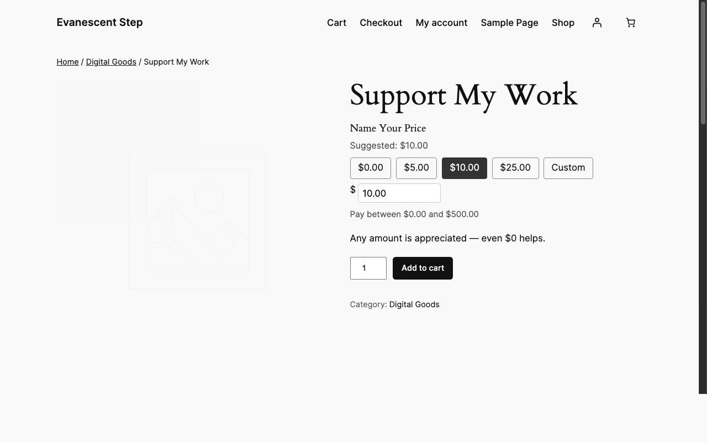
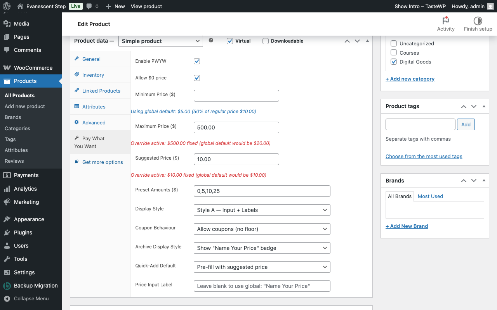
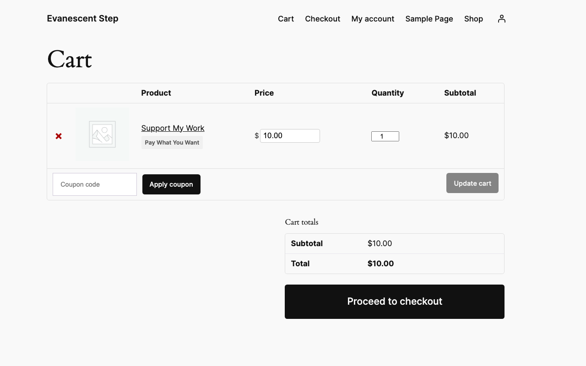
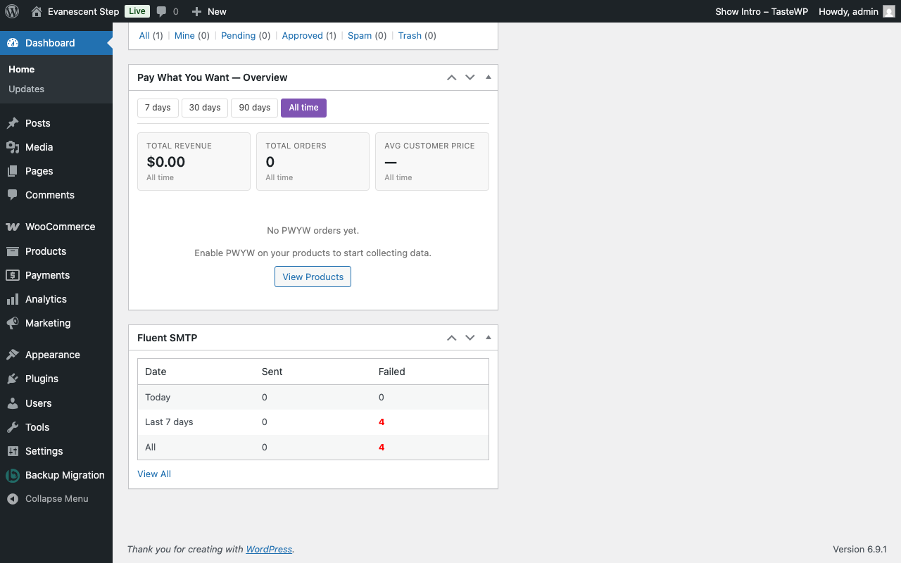
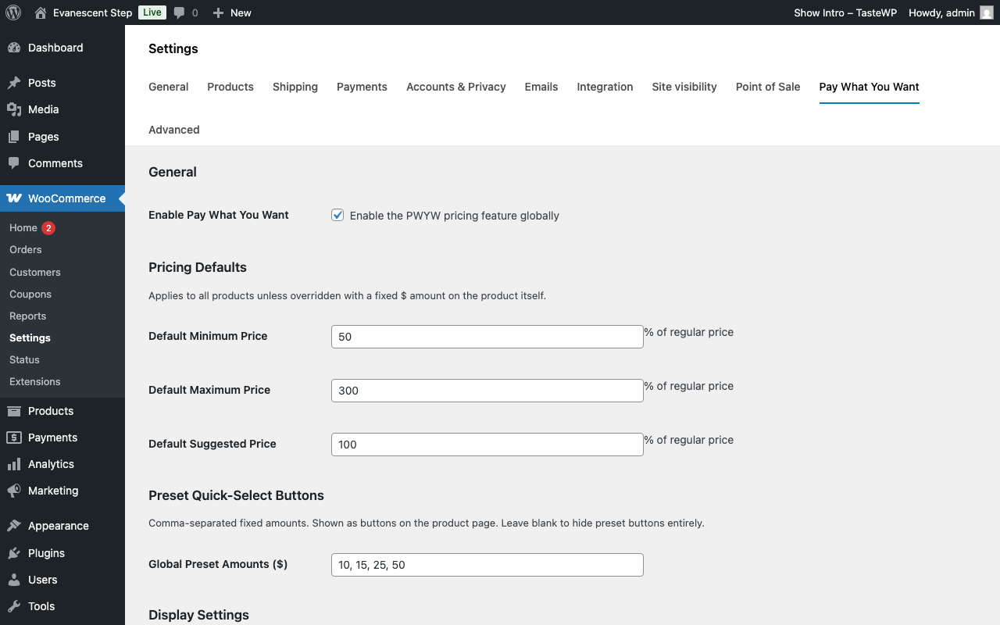
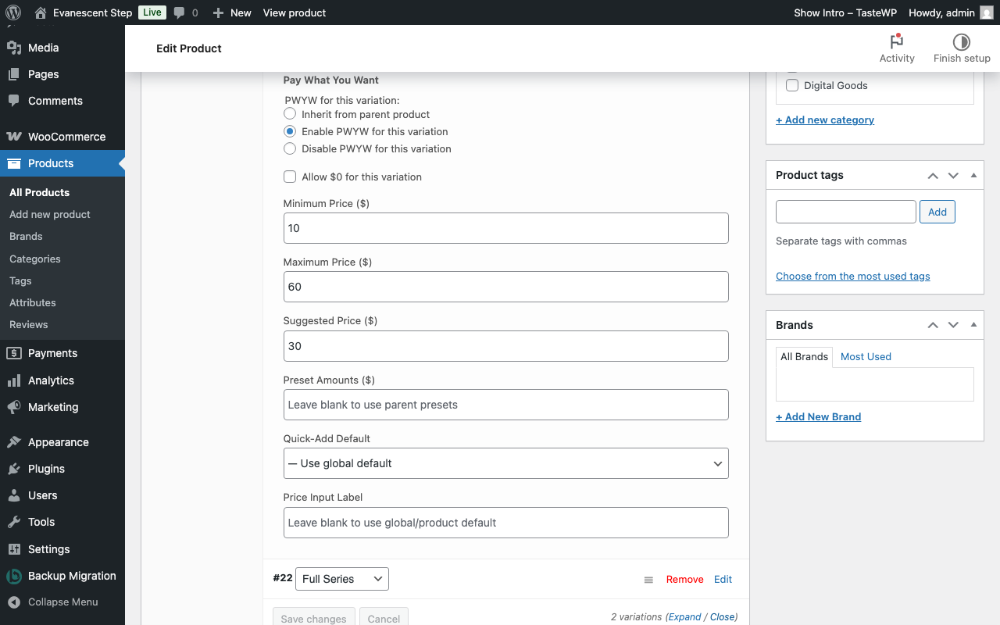
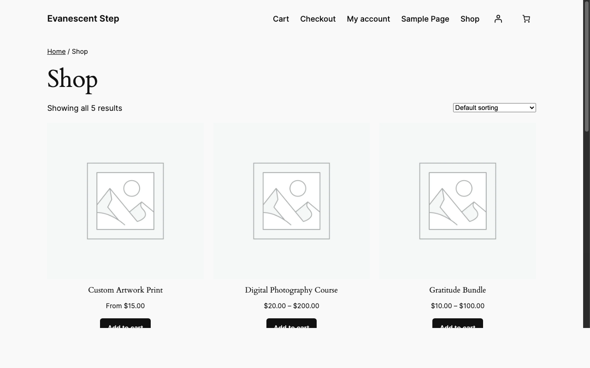
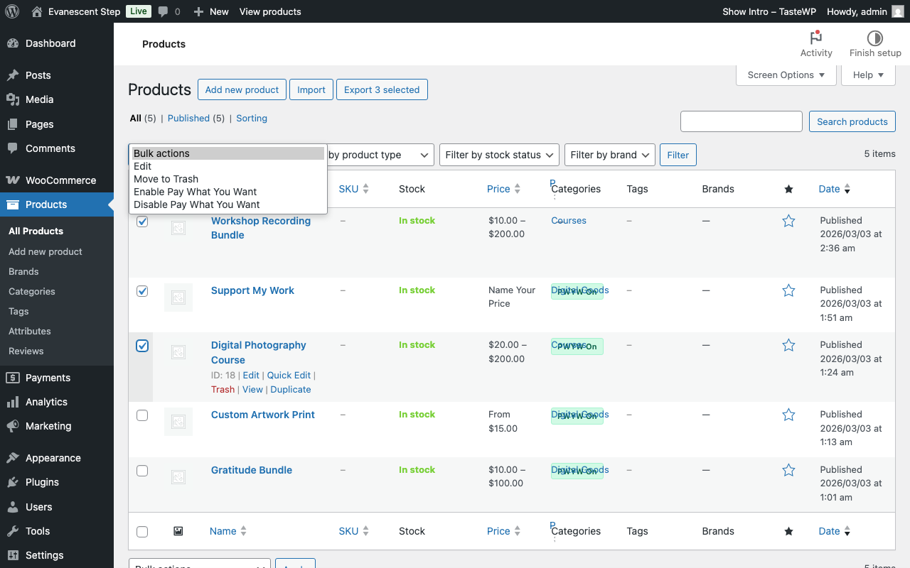

# WC Pay What You Want

A WooCommerce extension that lets customers set their own price within admin-defined boundaries. Supports simple, variable, virtual, and downloadable products.

<p align="center">
  
</p>

<p align="center">
  <video src="https://github.com/user-attachments/assets/441791d5-dd8e-4bf5-8246-c3ed5c662e02" width="700" controls></video>
</p>

<p align="center">
  <a href="https://github.com/nathanonn/wc-pay-what-you-want/releases/latest/download/wc-pay-what-you-want-latest.zip" target="_blank">
    
  </a>
</p>

> [!CAUTION]
> This plugin is **100% vibe coded** using [Claude Code](https://claude.ai/code). It is provided as-is with **no support, no warranty, and no guarantees**. Use it at your own risk.

> [!IMPORTANT]
> This plugin requires **WooCommerce** to be installed and active. It will display an admin notice and remain inactive without it.

## 🚀 Try Live Demo

Spin up a live WordPress environment with the plugin pre-installed — no setup required.

<p align="left">
  <a href="https://tastewp.com/recipe/fbea1cfe67" target="_blank">
    
  </a>
</p>

Once the site is ready, log in to the WordPress admin using these credentials:

| Field    | Value                          |
| -------- | ------------------------------ |
| Username | `admin`                        |
| Password | `Dnft8Cz%S1G-9*A^p#CQ@-e`     |

> [!NOTE]
> TasteWP demo sites are temporary and will expire after a short period.

## Features

### Pricing Controls

- Global defaults as percentages of regular price, with per-product fixed-amount overrides
- Suggested price anchoring pre-fills the input to guide customers
- Quick-select preset buttons (e.g., "$10", "$15", "$20", "Custom")
- Variable product support with per-variation overrides and parent inheritance
- Zero-price ($0) support configurable per product
- Sale price mutual exclusivity — PWYW replaces sale pricing entirely

<p align="center">
  
</p>

### Customer Experience

- Real-time inline validation with min/max boundary display
- Editable price input directly in the cart page
- Returning logged-in customers see their last-paid price pre-filled
- Configurable regular price display (strikethrough, reference label, range, or hidden)
- Configurable shop/archive display (price range, suggested, "From $X", or badge)

<p align="center">
  
</p>

### Store Management

- Coupon interaction modes: allow normally, enforce minimum floor, or block on PWYW products
- Mixed cart control — allow or restrict PWYW and regular products together
- Bulk enable/disable from the products list table or via bulk actions
- PWYW toggle column with inline switching — no need to open the product editor
- Server-side validation prevents all client-side bypasses

### Analytics & Notifications

- Dashboard widget with PWYW revenue, order count, average price, and price distribution
- Configurable email alerts when customers pay significantly above or below suggested price
- PWYW columns added to WooCommerce CSV order exports
- Historical order meta preserved regardless of future setting changes

<p align="center">
  
</p>

## Requirements

| Requirement | Version       |
| ----------- | ------------- |
| WordPress   | 6.0 or higher |
| WooCommerce | 8.0 or higher |
| PHP         | 8.0 or higher |

## Installation

1. Go to the [Releases page](https://github.com/nathanonn/wc-pay-what-you-want/releases) and download the latest ZIP file.

2. In your WordPress admin, go to **Plugins > Add New Plugin** and click **Upload Plugin**.

3. Choose the ZIP file you downloaded and click **Install Now**.

4. Activate the plugin, then navigate to **WooCommerce > Settings > Pay What You Want** to configure global defaults.

### Development Setup

Clone into your plugins directory and install dependencies:

```bash
cd wp-content/plugins/
git clone https://github.com/nathanonn/wc-pay-what-you-want.git
cd wc-pay-what-you-want
composer install --no-dev --optimize-autoloader
```

Activate the plugin in **Plugins > Installed Plugins**.

## Configuration

After activation, configure the plugin under **WooCommerce > Settings > Pay What You Want**:

| Setting             | What it controls                                                         |
| ------------------- | ------------------------------------------------------------------------ |
| Default Boundaries  | Minimum, maximum, and suggested price as percentages of regular price    |
| Global Presets      | Preset price buttons shown on all PWYW products                          |
| Price Display Style | How the regular price appears alongside the PWYW input                   |
| Archive Display     | How PWYW prices appear on shop/category pages                            |
| Quick-Add Default   | Which price to use when adding from non-product-page contexts            |
| Coupon Mode         | Allow, allow with floor enforcement, or block coupons on PWYW products   |
| Mixed Cart          | Allow or restrict PWYW and regular products in the same cart             |
| Email Alerts        | Threshold percentages and recipients for above/below suggested price     |
| Labels & Messages   | Customizable text for input labels, boundary display, and error messages |

### Per-Product Settings

Each product has a **Pay What You Want** tab in the product data panel:

| Level     | Where                                            | What you can override                                        |
| --------- | ------------------------------------------------ | ------------------------------------------------------------ |
| Product   | Product editor > Pay What You Want tab           | Enable/disable, min/max/suggested, presets, display, coupons |
| Variation | Variation editor > Override Parent PWYW checkbox | Enable/disable, min/max/suggested, presets                   |

Blank fields inherit from the parent product or global defaults.

## Documentation

For detailed guides on every feature, see the [full documentation](docs/):

| #   | Guide                                                   | Description                                                         |
| --- | ------------------------------------------------------- | ------------------------------------------------------------------- |
| 1   | [Getting Started](docs/01-getting-started.md)           | Installation, activation, requirements, and first-time setup        |
| 2   | [Global Settings](docs/02-global-settings.md)           | Configuring the PWYW settings tab in WooCommerce                    |
| 3   | [Setting Up Products](docs/03-product-setup.md)         | Enabling PWYW on individual simple products                         |
| 4   | [Variable Products](docs/04-variable-products.md)       | Working with variable products and per-variation overrides          |
| 5   | [Customer Experience](docs/05-customer-experience.md)   | What customers see on the product page, display styles, and presets |
| 6   | [Cart & Checkout](docs/06-cart-checkout.md)             | Cart price editing, coupons, mixed cart rules, and checkout         |
| 7   | [Orders & Analytics](docs/07-orders-analytics.md)       | Order data, dashboard widget, email alerts, and CSV export          |
| 8   | [Bulk Management](docs/08-bulk-management.md)           | Bulk enable/disable PWYW and the product list column                |
| 9   | [FAQ & Troubleshooting](docs/09-faq-troubleshooting.md) | Common questions, tips, and solutions                               |

## Architecture

```
wc-pay-what-you-want/
├── inc/                        # PHP classes (PSR-4: WcPwyw\)
│   ├── Admin/                  # Settings tab, product panel, bulk tools
│   ├── Frontend/               # Product page, cart, checkout
│   ├── Models/                 # Settings, ProductConfig, VariationConfig
│   ├── Services/               # PriceCalculator, Validator, CartHandler
│   └── Analytics/              # Dashboard widget, alert mailer
├── assets/
│   ├── css/                    # Admin and frontend stylesheets
│   └── js/                     # Admin and frontend scripts
├── templates/                  # Frontend template parts
├── languages/                  # i18n (.pot + .mo)
├── wc-pay-what-you-want.php    # Plugin bootstrap
└── composer.json               # PSR-4 autoloading
```

**Data storage:**

| Data                   | Location                     | Keys                          |
| ---------------------- | ---------------------------- | ----------------------------- |
| Global settings        | `wp_options`                 | `woocommerce_wcpwyw_settings` |
| Per-product settings   | `wp_postmeta`                | `_wcpwyw_*`                   |
| Per-variation settings | `wp_postmeta` (variation)    | `_wcpwyw_*`                   |
| Order line items       | `woocommerce_order_itemmeta` | `_wcpwyw_*`                   |
| Analytics              | Custom table                 | `wcpwyw_analytics`            |

## Screenshots

| Screen              | Preview                                                     |
| ------------------- | ----------------------------------------------------------- |
| Product Page        |                |
| Cart Page           |                      |
| Global Settings     |          |
| Product Editor      |            |
| Variation Overrides |  |
| Dashboard Widget    |        |
| Shop Page           |                      |
| Bulk Management     |          |

## Contributing

1. Fork the repository
2. Create a feature branch (`git checkout -b feature/your-feature`)
3. Commit your changes (`git commit -m 'Add your feature'`)
4. Push to the branch (`git push origin feature/your-feature`)
5. Open a Pull Request

Please follow [WordPress Coding Standards](https://developer.wordpress.org/coding-standards/) and ensure all server-side price validation remains intact.

## License

WC Pay What You Want is licensed under the [GNU General Public License v2.0 or later](https://www.gnu.org/licenses/gpl-2.0.html).

```
Copyright (C) 2026 NathanOnn.com

This program is free software; you can redistribute it and/or modify
it under the terms of the GNU General Public License as published by
the Free Software Foundation; either version 2 of the License, or
(at your option) any later version.
```
