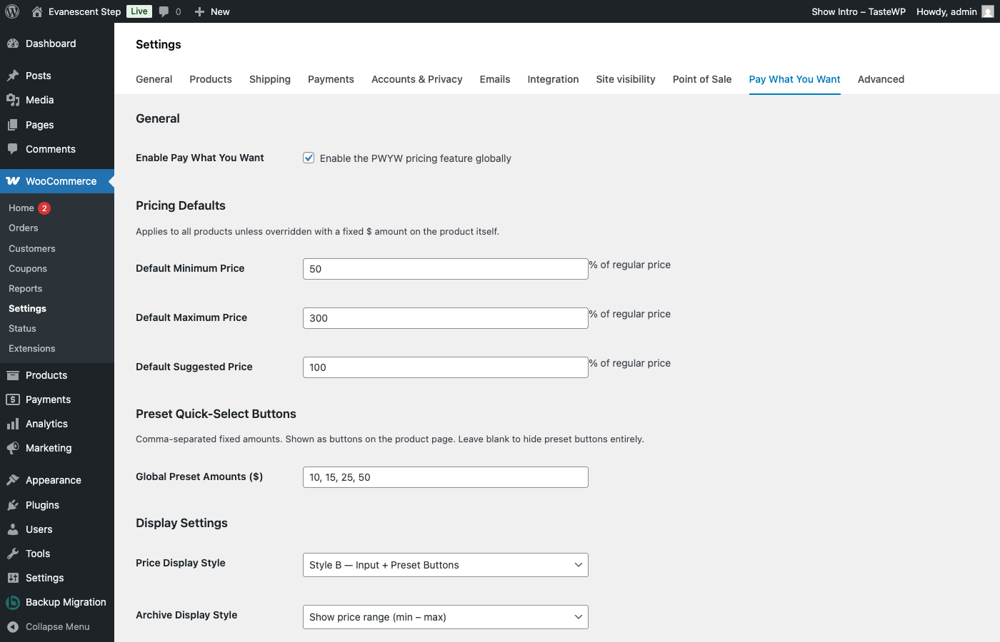

# Getting Started

## What is WC Pay What You Want?

WC Pay What You Want (PWYW) is a WooCommerce extension that lets your customers choose their own price for products. You stay in control by setting minimum and maximum price boundaries, suggested prices, and optional preset buttons -- customers get a flexible, transparent pricing experience on the frontend.

Whether you sell digital art, music, charitable goods, or anything where flexible pricing makes sense, PWYW gives you the tools to let customers decide what to pay while protecting your margins.

## Requirements

Before installing, make sure your site meets the following requirements:

- **WordPress** 5.x or higher
- **WooCommerce** (required -- the plugin will not activate without it)
- **PHP** 8.0 or higher

## Installation

1. Download the plugin zip file.
2. In your WordPress admin, go to **Plugins > Add New > Upload Plugin**.
3. Choose the zip file and click **Install Now**.
4. Click **Activate Plugin**.

The plugin automatically checks that WooCommerce is installed and active. If WooCommerce is not found, the plugin will display a notice and remain inactive until WooCommerce is available.

## First-Time Setup

After activating the plugin, follow these steps to configure PWYW for your store.

### Step 1: Open the Settings Tab

Go to **WooCommerce > Settings** and click the **Pay What You Want** tab at the top of the page.

### Step 2: Enable the Master Toggle

Check the **Enable Pay What You Want** checkbox. This turns on the PWYW pricing feature globally. Individual products still need to be enabled separately (see Step 6), but this master toggle must be on for any PWYW functionality to work.

### Step 3: Configure Pricing Defaults

Under **Pricing Defaults**, set the default boundaries that apply to all PWYW-enabled products unless overridden on a specific product:

- **Default Minimum Price** -- The lowest price a customer can enter, expressed as a percentage of the product's regular price. For example, `50` means customers can pay as low as half the regular price.
- **Default Maximum Price** -- The highest price a customer can enter, as a percentage of the regular price. For example, `300` means customers can pay up to three times the regular price.
- **Default Suggested Price** -- The pre-filled price shown to customers, as a percentage of the regular price. For example, `100` means the suggested price equals the regular price.

### Step 4: Set Up Preset Buttons

Under **Preset Quick-Select Buttons**, enter comma-separated dollar amounts in the **Global Preset Amounts ($)** field. These appear as clickable buttons on the product page so customers can quickly select a common price without typing. For example: `10, 15, 25, 50`.

Leave the field blank if you do not want preset buttons to appear.

### Step 5: Choose Display Settings

Under **Display Settings**, configure how PWYW pricing appears to customers:

- **Price Display Style** -- Choose how the pricing input appears on the product page (for example, input field with preset buttons, or input field only).
- **Archive Display Style** -- Choose how PWYW prices appear on shop/archive pages (for example, show the price range from minimum to maximum).

Click **Save changes** when you are done.

### Step 6: Enable PWYW on a Product

1. Go to **Products** and edit any product.
2. In the **Product data** panel, click the **Pay What You Want** tab.
3. Check the box to enable PWYW for that product.
4. Optionally, override the global pricing defaults with fixed dollar amounts specific to this product.
5. Click **Update** to save the product.

Visit the product page on your storefront to see the PWYW pricing interface in action.

## Supported Product Types

PWYW works with the following WooCommerce product types:

| Product Type | Supported | Notes |
|---|---|---|
| Simple | Yes | Standard products with a single price |
| Virtual | Yes | Non-physical products (services, access, etc.) |
| Downloadable | Yes | Digital files available for download |
| Variable | Yes | Products with variations -- each variation can have its own PWYW overrides |

## How It Works

Here is the end-to-end flow of a PWYW transaction:

1. **You configure pricing.** Set global defaults in the settings tab, then enable PWYW on individual products. Optionally override pricing boundaries per product or per variation.

2. **Customer visits the product page.** Instead of a fixed price, the customer sees a pricing input with your suggested price pre-filled, along with any preset buttons you configured. The allowed range (minimum to maximum) is displayed clearly.

   

3. **Customer chooses their price.** They can click a preset button, type a custom amount, or keep the suggested price. The plugin validates the amount in real time against your minimum and maximum boundaries.

4. **Customer adds to cart.** The chosen price is attached to the cart item. Customers can also edit their PWYW price directly from the cart page before checkout.

5. **Customer completes checkout.** The order is placed at the customer's chosen price. All PWYW data (customer price, suggested price, boundaries) is saved to the order for your records.

6. **You review the data.** PWYW order details appear in the order admin screen, and aggregate data is available in the dashboard analytics widget.

---

Next: [Global Settings](02-global-settings.md) -- A detailed walkthrough of every option on the settings page.
