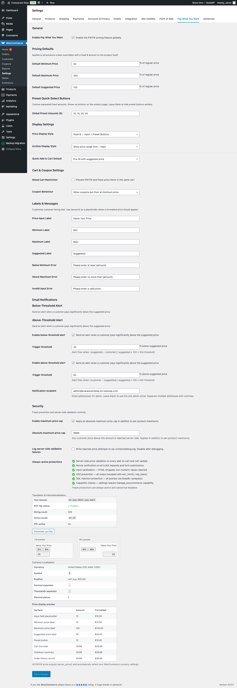

# Global Settings

The **Pay What You Want** settings tab is your central control panel for the PWYW feature. Everything you configure here applies store-wide and acts as the default for all PWYW-enabled products, unless you override specific values on individual products or variations.

To access these settings, go to **WooCommerce > Settings > Pay What You Want**.

---

## Table of Contents

- [General](#general)
- [Pricing Defaults](#pricing-defaults)
- [Preset Quick-Select Buttons](#preset-quick-select-buttons)
- [Display Settings](#display-settings)
- [Cart & Coupon Settings](#cart--coupon-settings)
- [Labels & Messages](#labels--messages)
- [Email Notifications](#email-notifications)
- [Security](#security)
- [Translation & Internationalisation](#translation--internationalisation)
- [Currency Localisation](#currency-localisation)

---

## General

| Field | Type | Default |
|-------|------|---------|
| **Enable Pay What You Want** | Checkbox | Off |

This is the master on/off switch for the entire PWYW feature. When unchecked, no PWYW pricing interface will appear anywhere on your store, even if you have configured individual products with PWYW settings. Your settings are still saved, so you can safely toggle this off for maintenance or seasonal changes and turn it back on later without losing your configuration.

**When to change it:** Turn this on after you have finished configuring the rest of the settings on this page and have enabled PWYW on at least one product. Turn it off if you want to temporarily suspend PWYW across your entire store without removing per-product settings.

**Tip:** When the toggle is off, you will see an informational banner reminding you that PWYW is disabled. All other settings below remain editable so you can prepare everything before going live.

---

## Pricing Defaults

These percentage-based defaults apply to every PWYW product unless you override them with fixed dollar amounts on the product itself (see [Setting Up Products](03-product-setup.md)).

| Field | Type | Default | Description |
|-------|------|---------|-------------|
| **Default Minimum Price** | Number (%) | 50 | Percentage of the product's regular price that serves as the lowest price a customer can pay |
| **Default Maximum Price** | Number (%) | 200 | Percentage of the product's regular price that serves as the highest price a customer can pay |
| **Default Suggested Price** | Number (%) | 100 | Percentage of the product's regular price shown as the recommended amount |

### How the percentages work

All three fields are expressed as a **percentage of the product's regular WooCommerce price**. For example, if a product has a regular price of $20.00:

| Setting | Percentage | Resulting price |
|---------|-----------|-----------------|
| Minimum | 50% | $10.00 |
| Suggested | 100% | $20.00 |
| Maximum | 200% | $40.00 |

### Validation rule

The maximum percentage must be **strictly greater** than the minimum percentage. If you enter a maximum that is equal to or lower than the minimum, the settings will not save and you will see an error message.

**When to change these:**

- **Lower the minimum** if you want to let customers pay less (great for "pay what you can" charity models).
- **Raise the maximum** if you want to allow generous customers to pay more (common for tips, donations, or "support the creator" products).
- **Adjust the suggested price** to anchor customer expectations. Setting it to 100% means you are suggesting the regular price. Setting it to 80% signals a discount. Setting it to 120% gently encourages customers to pay a premium.

**Tip:** These defaults are a starting point. You can always override them on individual products with fixed dollar amounts. For example, you might set global defaults of 50%/100%/200% but override one specific product with a fixed minimum of $5.00 and a fixed maximum of $50.00.

---

## Preset Quick-Select Buttons

| Field | Type | Default | Placeholder |
|-------|------|---------|-------------|
| **Global Preset Amounts ($)** | Text | 10,15,20,25 | e.g. 10,15,20,25 |

Preset buttons appear on the product page as clickable quick-select options. When a customer clicks one, the price input is automatically filled with that amount. This reduces friction and speeds up the purchasing process.

Enter your amounts as **comma-separated positive numbers**. For example: `10, 15, 25, 50`

To hide preset buttons entirely, leave this field blank.

**When to change these:**

- **Tailor amounts to your price range.** If most of your products are $50-$200, preset buttons of $10 and $15 may not be useful. Try something like `50, 75, 100, 150` instead.
- **Keep it to 3-5 options.** Too many buttons can overwhelm customers. Choose amounts that represent meaningful price points (budget, standard, generous, premium).
- **Match your suggested prices.** Include your most common suggested price as one of the presets so customers can select it with one click.

**Tip:** These are global defaults. You can override preset amounts on individual products if different products need different quick-select options. Presets only appear when using display styles B or C (see Display Settings below).

**Validation:** Each value must be a positive number. Entries like `free`, `0`, or `-5` will be rejected.

---

## Display Settings

These settings control how PWYW pricing appears to customers on product pages and in shop archives.

### Price Display Style

| Option | What the customer sees |
|--------|----------------------|
| **Style A -- Input + Labels** | A price input field with min, suggested, and max labels shown alongside it |
| **Style B -- Input + Preset Buttons** | A price input field with clickable preset amount buttons |
| **Style C -- Input + Presets + Labels** | A price input field with both preset buttons and min/suggested/max labels |
| **Style D -- Minimal** | A price input field only, with no labels or presets |

**Default:** Style A

**When to change it:**

- Choose **Style A** when you want customers to clearly see the acceptable price range.
- Choose **Style B** if you prefer quick-click convenience and your preset amounts already communicate the range.
- Choose **Style C** for maximum information -- customers see the price range labels and can quickly click a preset.
- Choose **Style D** for a clean, minimal look -- best when you have few constraints and want maximum flexibility.

**Tip:** If you choose Style B or C, make sure you have preset amounts configured (see above). Without presets, Style B will look the same as Style D.

### Archive Display Style

Controls what price text appears for PWYW products on shop pages, category pages, and any other product listing (archive) page.

| Option | Example output |
|--------|---------------|
| **Show price range (min -- max)** | $10.00 -- $40.00 |
| **Show suggested price only** | $20.00 |
| **Show "From $X" (minimum price)** | From $10.00 |
| **Show "Name Your Price"** | Name Your Price |

**Default:** Show price range (min -- max)

**When to change it:**

- **Price range** is the most transparent option and works well for most stores.
- **Suggested price only** is good if you want the archive to look like a normal shop -- customers discover the PWYW feature when they visit the product page.
- **"From $X"** works well if your minimum is the anchor price and you want to communicate affordability.
- **"Name Your Price"** is ideal for donations, tips, or creative/artistic products where the concept of naming your price is part of the appeal.

### Quick-Add to Cart Default

Controls what happens when customers use the "Add to Cart" button directly from shop/archive pages (without visiting the product page first).

| Option | Behaviour |
|--------|-----------|
| **Pre-fill with suggested price** | Adds the product to cart at the suggested price |
| **Pre-fill with minimum price** | Adds the product to cart at the minimum price |
| **Block quick-add (require product page)** | Disables the archive "Add to Cart" button and shows a "Select options" link instead, forcing customers to visit the product page to enter their price |

**Default:** Pre-fill with suggested price

**When to change it:**

- **Suggested price** is the best default for most stores -- it matches the regular purchasing flow.
- **Minimum price** can work if you want to lower the barrier for impulse purchases (customers can always adjust in the cart).
- **Block quick-add** is recommended if choosing a custom price is an important part of your customer experience, or if you want to make sure customers see the full PWYW interface before purchasing.

---

## Cart & Coupon Settings

### Mixed Cart Restriction

| Field | Type | Default |
|-------|------|---------|
| **Prevent PWYW and fixed-price items in the same cart** | Checkbox | Off |

When enabled, customers cannot add both PWYW products and regular fixed-price products to the same cart. If they try, they will see a notice asking them to complete or clear their current cart first.

**When to enable it:**

- If your store has distinct PWYW products (like donations or pay-what-you-can items) that should not be mixed with regular merchandise.
- If you want to simplify checkout logic and reporting by keeping PWYW and fixed-price orders separate.

**Tip:** Most stores can leave this off. Only enable it if you have a specific business reason to keep these order types separate.

### Coupon Behaviour

| Option | What happens |
|--------|-------------|
| **Allow coupons (no floor)** | Coupons apply normally to PWYW items, and the final price can go below the minimum price |
| **Allow coupons but floor at minimum price** | Coupons apply but the final price will never go below the product's minimum price |
| **Block all coupons on PWYW items** | Coupons are completely ignored for PWYW products |

**Default:** Allow coupons (no floor)

**When to change it:**

- Choose **Allow coupons (no floor)** if you are comfortable with coupon discounts potentially pushing prices below your minimum.
- Choose **Allow coupons but floor at minimum price** if you want to offer coupons but still protect your minimum price boundary. This is the safest option for most stores.
- Choose **Block all coupons** if PWYW products already represent a flexible pricing model and adding coupons on top would undermine your pricing strategy.

**Tip:** If you run frequent sales or promotions with coupon codes, the "floor at minimum" option gives you the best of both worlds -- customers feel rewarded by the coupon, but you are protected from prices dropping too low.

---

## Labels & Messages

Customise the text that your customers see on the product page and in error messages. This section is especially useful if your store is not in English, or if you want to match your brand voice.

You can use the **`{amount}`** placeholder in any field where a formatted price should appear. The plugin will replace `{amount}` with the actual price in your store's currency format (e.g., `$10.00`, `25,00 EUR`).

| Field | Default | Where it appears |
|-------|---------|-----------------|
| **Price Input Label** | Name Your Price | Above the price input field on the product page |
| **Minimum Label** | Minimum: {amount} | Below the input, showing the lowest accepted price |
| **Maximum Label** | Maximum: {amount} | Below the input, showing the highest accepted price |
| **Suggested Label** | Suggested: {amount} | Below the input, showing the recommended price |
| **Below Minimum Error** | Please enter at least {amount}. | Shown when a customer enters a price below the minimum |
| **Above Maximum Error** | Please enter no more than {amount}. | Shown when a customer enters a price above the maximum |
| **Invalid Input Error** | Please enter a valid price. | Shown when a customer enters non-numeric or empty input |

**Examples of customisation:**

- Change "Name Your Price" to "Choose Your Price", "Set Your Price", or "What's It Worth to You?"
- Change "Minimum: {amount}" to "Starting at {amount}" or "At least {amount}"
- Change "Please enter at least {amount}." to "The minimum price for this item is {amount}."

**Tip:** Keep error messages clear and helpful. Customers should immediately understand what went wrong and what they need to do. Avoid overly casual or vague language in error messages.

---

## Email Notifications

Get notified by email when customers pay significantly above or below your suggested price. This helps you spot trends, identify potential issues, or celebrate generous customers.

### Below-Threshold Alert

| Field | Type | Default |
|-------|------|---------|
| **Enable below-threshold alert** | Checkbox | On |
| **Trigger threshold** | Number (%) | 30 |

When enabled, you receive an email alert whenever a customer pays more than the specified percentage below the suggested price.

**How the threshold works:** If your suggested price is $20.00 and the threshold is 30%, you will be alerted when a customer pays less than $14.00 (i.e., more than 30% below $20.00).

**When to change the threshold:**

- **Lower the percentage** (e.g., 10%) if you want to be notified about even small deviations below the suggested price.
- **Raise the percentage** (e.g., 50%) if you only want alerts for extreme cases where customers are paying well below expectations.

### Above-Threshold Alert

| Field | Type | Default |
|-------|------|---------|
| **Enable above-threshold alert** | Checkbox | On |
| **Trigger threshold** | Number (%) | 50 |

When enabled, you receive an email alert whenever a customer pays more than the specified percentage above the suggested price.

**How the threshold works:** If your suggested price is $20.00 and the threshold is 50%, you will be alerted when a customer pays more than $30.00 (i.e., more than 50% above $20.00).

**When to use it:** This is great for spotting generous customers you might want to thank personally, or for detecting unusually high payments that might indicate a data entry error or potential fraud.

### Notification Recipient

| Field | Type | Default |
|-------|------|---------|
| **Notification recipient** | Email | (site admin email) |

Enter one or more email addresses to receive PWYW alerts. Separate multiple addresses with commas. If left blank, alerts go to your site's admin email address (configured in WordPress Settings > General).

**Example:** `shop@example.com, manager@example.com`

**Tip:** Both the below-threshold and above-threshold alerts are sent to the same recipient(s). If you want different people to handle different types of alerts, you can set up email filters or forwarding rules in your email client.

---

## Security

These settings help protect your store from fraudulent or unintended price submissions.

### Enable Maximum Price Cap

| Field | Type | Default |
|-------|------|---------|
| **Enable maximum price cap** | Checkbox | On |
| **Absolute maximum price cap** | Number | 9999 |

When enabled, this sets a hard ceiling on any customer-entered price across your entire store. Even if a product's per-product maximum is higher, no price above this cap will be accepted.

This protects against scenarios like:
- A customer accidentally entering $10,000 instead of $100
- Malicious users submitting extremely high prices to test your payment processing
- Automated bots probing your store

**When to change the cap value:** Adjust it to a reasonable maximum for your business. If your most expensive PWYW product could legitimately sell for $500, setting the cap to $1,000 or $2,000 gives you a sensible safety margin.

### Log Server-Side Validation Failures

| Field | Type | Default |
|-------|------|---------|
| **Log server-side validation failures** | Checkbox | Off |

When enabled, every rejected price attempt (below minimum, above maximum, non-numeric input, etc.) is written to `wp-content/debug.log`. This is useful for debugging and monitoring, but can generate a lot of log data on busy stores.

**When to enable it:** Turn this on temporarily if you suspect fraudulent activity or if customers are reporting unexpected errors. Turn it off when you are done investigating.

**Tip:** You will need WordPress debug logging enabled (`WP_DEBUG_LOG` set to `true` in `wp-config.php`) for this to work. Ask your developer or hosting provider if you are unsure.

### Always-Active Protections

This read-only section lists security measures that are always enabled and cannot be turned off:

- **Server-side price validation** on every add-to-cart and cart update
- **Nonce verification** on all AJAX requests and form submissions
- **Input sanitisation** -- HTML is stripped, non-numeric values are rejected
- **XSS prevention** -- all output is escaped
- **SQL injection protection** -- all database queries use prepared statements
- **Capability checks** -- only users with appropriate permissions can change settings

These protections are built into the plugin at the code level. You do not need to configure anything -- they are listed here for your peace of mind.

---

## Translation & Internationalisation

This read-only panel shows the current translation status of the plugin. There are no settings to change here -- it is purely informational.

| Item | Description |
|------|-------------|
| **Text domain** | The internal identifier used for translations: `wc-pay-what-you-want` |
| **POT file status** | Whether the translation template file exists (required for creating translations) |
| **String count** | How many translatable text strings the plugin contains |
| **Active locale** | Your WordPress site's current language setting (e.g., `en_US`, `de_DE`, `ar`) |
| **RTL active** | Whether your site is currently using a right-to-left language |

Below the table, you will see a side-by-side **LTR / RTL layout preview** showing how the PWYW interface looks in both left-to-right and right-to-left languages. This is useful if your store serves customers in RTL languages like Arabic or Hebrew.

**Download .pot file:** If the POT file is present, you can download it directly from this section. Hand it to a translator or use a tool like [Poedit](https://poedit.net/) to create translations for your language.

**Tip:** To change your store's language, go to **Settings > General** in WordPress and select your preferred site language. The plugin will use any available translation file for that language automatically.

---

## Currency Localisation

This read-only panel shows how the plugin formats prices based on your WooCommerce currency settings. There are no settings to change here -- all configuration comes from your WooCommerce settings.

### Currency Settings Summary

The top table shows your current WooCommerce currency configuration:

| Item | What it means |
|------|--------------|
| **Currency** | Your store's active currency (e.g., US Dollar, Euro, British Pound) |
| **Symbol** | The currency symbol used in price displays (e.g., $, EUR, GBP) |
| **Position** | Where the symbol appears relative to the number (left, right, left with space, right with space) |
| **Decimal separator** | The character between whole numbers and cents (e.g., `.` or `,`) |
| **Thousands separator** | The character between groups of thousands (e.g., `,` or `.`) |
| **Decimal places** | How many decimal digits are shown (usually 2) |

### Price Display Preview

The bottom table shows sample prices as they will appear across different parts of the PWYW interface, including input field placeholders, labels, preset buttons, cart totals, checkout summaries, and order history records.

**Tip:** If the preview does not look right, you do not need to change anything in the PWYW plugin. Instead, go to **WooCommerce > Settings > General** and adjust your currency options there. The PWYW plugin always follows your WooCommerce currency settings automatically.

---

## Saving Your Settings

After making changes, click the **Save changes** button at the bottom of the page. WooCommerce will validate your inputs and show any errors at the top of the page if something needs to be corrected (for example, if your maximum percentage is not greater than your minimum).

Settings are saved immediately and take effect on the next page load. There is no need to clear caches or restart anything.

---

## Next Steps

- [Setting Up Products](03-product-setup.md) -- Learn how to enable PWYW on individual products and override global defaults.
- [Variable Products](04-variable-products.md) -- Configure PWYW on variable products with per-variation overrides.
- [Customer Experience](05-customer-experience.md) -- See what the different display styles look like for your customers.
