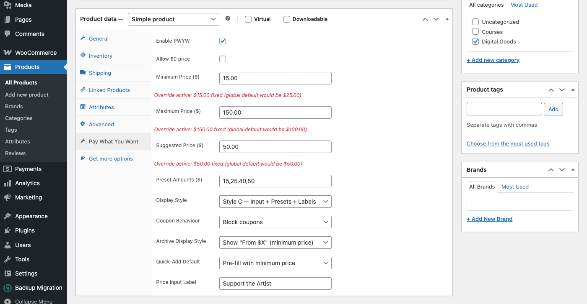

# Setting Up Products

This guide covers how to enable Pay What You Want pricing on individual simple products. For variable products with per-variation overrides, see [Variable Products](04-variable-products.md).

## Accessing the PWYW Product Tab

1. Go to **WooCommerce > Products** in your WordPress admin.
2. Click **Edit** on any existing product, or create a new one.
3. Scroll down to the **Product data** panel (the large tabbed box below the product description).
4. Click the **Pay What You Want** tab on the left side of the panel.

The Pay What You Want tab appears for **Simple**, **Virtual**, and **Downloadable** product types. If you do not see the tab, make sure the product type dropdown (at the top of the Product data panel) is set to one of these types.

## Core Settings

These two checkboxes control whether PWYW is active for this product and whether free orders are allowed.

### Enable PWYW

Check this box to turn on Pay What You Want pricing for this product. When enabled, customers will see a price input field instead of the standard fixed price on the product page.

**Important:** The product must also have a **Regular price** set in the **General** tab. The plugin uses the regular price as the baseline for calculating percentage-based global defaults (minimum, maximum, and suggested prices). If no regular price is set, the global percentage calculations will resolve to $0.

When you check this box, the remaining PWYW settings fields appear below. When unchecked, a notice reads: "PWYW is disabled for this product. Enable it above to configure pricing."

### Allow $0 Price

Check this box to allow customers to enter $0, making the product completely free. This is useful for:

- **Donation-based products** where any amount (including nothing) is acceptable
- **"Pay what you can" models** designed for accessibility
- **Free samples or trials** where you want to track orders even at zero cost

Use this option cautiously -- when enabled, customers can complete checkout without paying anything for this product.

## Pricing Overrides

By default, every PWYW product inherits its price boundaries from the global settings (configured in **WooCommerce > Settings > Pay What You Want**). The global settings use percentages of the product's regular price to calculate minimum, maximum, and suggested prices.

The fields below let you override those global defaults with fixed dollar amounts for this specific product.

### Minimum Price ($)

The lowest price a customer is allowed to enter.

- **Leave blank** to use the global default (a percentage of the regular price).
- **Enter a dollar amount** to set a fixed minimum that overrides the global calculation.

### Maximum Price ($)

The highest price a customer is allowed to enter.

- **Leave blank** to use the global default.
- **Enter a dollar amount** to set a fixed maximum override.

**Validation rule:** If you set both a minimum and maximum price, the maximum must be greater than the minimum. If you save with a maximum that is less than or equal to the minimum, both values are cleared back to blank and an error message appears at the top of the page: "PWYW Maximum Price must be greater than Minimum Price."

### Suggested Price ($)

The price that is pre-filled in the input field when a customer loads the product page. This serves as an anchor point -- customers can change it, but the suggested price influences what they are likely to pay.

- **Leave blank** to use the global default.
- **Enter a dollar amount** to set a fixed suggested price override.

### Understanding the Helper Text

Each pricing field displays helper text below it to show you what price would apply:

- **When no override is set** (field is blank), the helper text reads:
  "Using global default: $25.00 (50% of regular price $50.00)"

- **When an override is active** (field has a value), the helper text reads in red:
  "Override active: $15.00 fixed (global default would be $25.00)"

This makes it easy to compare your override against what the global setting would calculate, so you can make an informed decision about whether to use a fixed value or stick with the default.

## Preset Buttons

### Preset Amounts ($)

Preset buttons are clickable shortcuts that appear on the product page, letting customers quickly select a common price without typing. Enter amounts as a comma-separated list of dollar values.

- **Leave blank** to use the global preset amounts configured in the settings tab.
- **Enter amounts** (e.g., `15,25,40,50`) to override the global presets for this product only.

The placeholder text shows you what the current global presets are, so you know what will be used if you leave the field blank.

**Note:** Preset amounts that fall outside the product's min/max boundaries are automatically hidden on the frontend. For example, if the minimum price is $10 and you have a $5 preset, that button will not appear.

## Display and Behavior Overrides

These dropdown fields let you override global display and behavior settings for this specific product. Each dropdown defaults to "Use global default" -- only change them if you need this product to behave differently from the rest of your PWYW products.

### Display Style

Controls how the PWYW pricing interface looks on the product page.

| Option | Description |
|--------|-------------|
| Use global default | Inherits the style set in global settings |
| Style A -- Input + Labels | Price input field with text labels showing the allowed range |
| Style B -- Input + Preset Buttons | Price input field with clickable preset buttons |
| Style C -- Input + Presets + Labels | Price input field with both preset buttons and range labels |
| Style D -- Minimal | Simplified price input with minimal surrounding elements |

### Coupon Behaviour

Controls how discount coupons interact with PWYW pricing on this product.

| Option | Description |
|--------|-------------|
| Use global default | Inherits the setting from global settings |
| Allow coupons (no floor) | Coupons can reduce the price with no restriction |
| Allow with floor | Coupons are allowed but cannot reduce the price below the minimum |
| Block coupons | Coupons are not applied to this PWYW product |

### Archive Display Style

Controls how the price appears on shop pages, category pages, and other product listing pages.

| Option | Description |
|--------|-------------|
| Use global default | Inherits the setting from global settings |
| Show price range (min -- max) | Displays the full price range, e.g., "$15.00 -- $150.00" |
| Show suggested price only | Displays the suggested price |
| Show "From $X" (minimum price) | Displays the minimum price with a "From" prefix |
| Show "Name Your Price" badge | Displays a text badge instead of a numeric price |

### Quick-Add Default

Controls what happens when a customer uses the "Add to Cart" button on shop/archive pages (where there is no price input field).

| Option | Description |
|--------|-------------|
| Use global default | Inherits the setting from global settings |
| Pre-fill with suggested price | Adds to cart at the suggested price |
| Pre-fill with minimum price | Adds to cart at the minimum price |
| Block quick-add (require product page) | Disables the archive "Add to Cart" button and directs customers to the product page |

### Price Input Label

The text label shown above the price input field on the product page. For example, you might change this to "Support the Artist", "Pay What You Can", or "Choose Your Price" instead of the default.

- **Leave blank** to use the global label (shown in the placeholder text).
- **Enter custom text** to override the label for this product only.

## How Pricing Resolution Works

When a customer visits a PWYW product page, the plugin determines the minimum, maximum, and suggested prices using this hierarchy:

1. **Product-level fixed override** -- If you entered a dollar amount in the product's PWYW tab, that value is used.
2. **Global percentage calculation** -- If no product-level override is set, the plugin calculates the price as a percentage of the product's regular price, using the percentages from the global settings tab.

### Example

Consider a product with a **$50.00 regular price** and these global settings:

| Setting | Global Value | Calculated Amount |
|---------|-------------|-------------------|
| Default Minimum | 50% | $25.00 |
| Default Maximum | 200% | $100.00 |
| Default Suggested | 100% | $50.00 |

Without any product-level overrides, customers would see a price input pre-filled at $50.00, with an allowed range of $25.00 to $100.00.

Now suppose you set a **product-level minimum of $15.00**. The minimum becomes $15.00 (the fixed override), while the maximum and suggested prices remain at $100.00 and $50.00 respectively (calculated from the global percentages).

## Step-by-Step: Enable PWYW on a Simple Product

1. Go to **WooCommerce > Products** and click **Edit** on the product you want to configure.
2. In the **Product data** panel, click the **General** tab and make sure the product has a **Regular price** set. This is required -- the plugin uses it as the baseline for percentage-based calculations.
3. Click the **Pay What You Want** tab in the Product data panel.
4. Check the **Enable PWYW** checkbox. The rest of the settings fields will appear.
5. Optionally check **Allow $0 price** if you want customers to be able to pay nothing.
6. Optionally enter fixed amounts for **Minimum Price**, **Maximum Price**, and **Suggested Price**. Leave any field blank to use the global default. Review the helper text below each field to confirm what price will apply.
7. Optionally enter **Preset Amounts** as a comma-separated list (e.g., `15,25,40,50`). Leave blank to use global presets.
8. Optionally change any of the display and behavior dropdowns if this product needs different settings from the global defaults.
9. Click **Update** (or **Publish** for a new product) to save.
10. Visit the product page on your storefront to verify the PWYW pricing interface appears correctly.

---

Next: [Variable Products](04-variable-products.md) -- Configuring PWYW on variable products with per-variation overrides.
