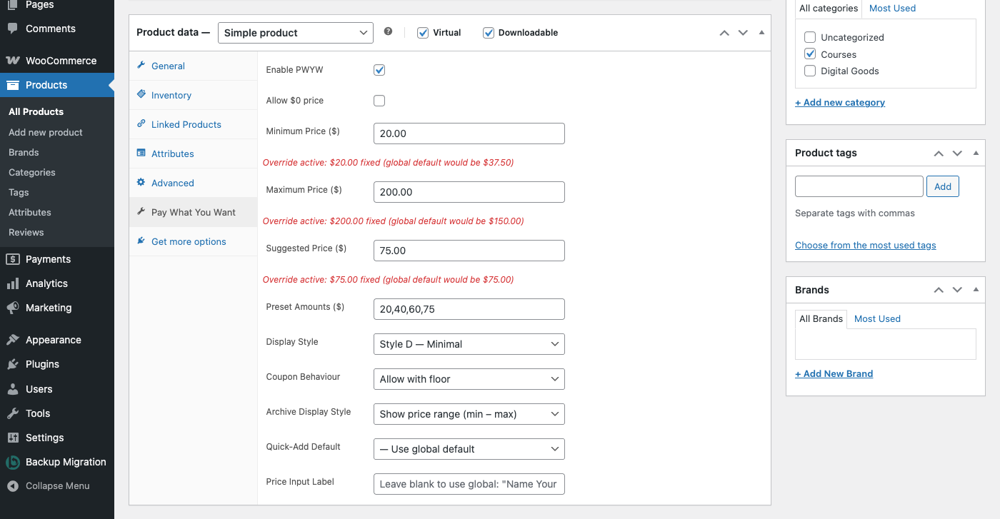
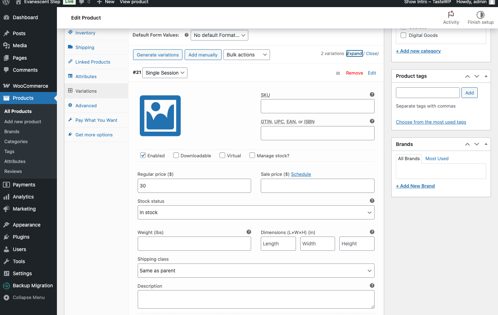

# Variable Products

Variable products let you offer multiple options for a single product -- for example, a course with "Single Session" and "Full Series" variations, or a design package with "Basic" and "Premium" tiers. WC Pay What You Want integrates with variable products so you can control PWYW pricing at both the parent product level and the individual variation level.

This guide covers how to configure PWYW for variable products, how the inheritance model works, and what customers see on the frontend.

## How PWYW Works with Variable Products

A variable product in WooCommerce has two layers: the **parent product** and its **variations**. Each variation has its own regular price, stock, and other attributes. PWYW mirrors this structure:

- The **parent product** has a Pay What You Want tab where you enable PWYW and set display-level overrides.
- Each **variation** has its own PWYW settings section where you can inherit the parent's configuration, override it with variation-specific pricing, or disable PWYW entirely for that variation.

This two-layer approach gives you full flexibility. You can apply PWYW uniformly across all variations, enable it on some while keeping others at a fixed price, or set completely different pricing boundaries for each variation.

## Parent Product Settings

To configure PWYW on a variable product:

1. Go to **Products** and edit your variable product.
2. In the **Product data** panel, click the **Pay What You Want** tab.



The settings available at the parent level for a variable product are:

| Setting | Description |
|---|---|
| **Enable PWYW** | Master toggle for this product. Variations set to "Inherit" will follow this. |
| **Display Style** | Override the global display style for the pricing input on the product page. |
| **Coupon Behaviour** | Override the global coupon behavior for this product. |
| **Archive Display Style** | Override how this product's price appears on shop and category pages. |
| **Quick-Add Default** | Override the global quick-add default (how the price field is pre-filled). |
| **Price Input Label** | Override the label shown above the price input field. |

**Why are there no pricing fields?** Unlike simple products, the parent level of a variable product does not show Minimum Price, Maximum Price, Suggested Price, or Preset Amounts fields. This is because each variation has its own regular price, and pricing boundaries need to relate to a specific price point. These fields are configured per variation instead.

## Per-Variation PWYW Settings

Each variation has its own PWYW controls. To access them:

1. Click the **Variations** tab in the Product data panel.
2. Expand any variation by clicking on it.
3. Scroll down to the **Pay What You Want** section.



### PWYW Mode

At the top of the variation's PWYW section, you will see a radio group labeled **PWYW for this variation** with three options:

#### 1. Inherit from parent product (default)

The variation follows the parent product's PWYW configuration. If the parent has PWYW enabled, this variation will use PWYW with the global percentage-based defaults applied to this variation's regular price.

For example, if the global default minimum is 50% and this variation's regular price is $40, the calculated minimum price for this variation will be $20.

No additional fields are shown when this option is selected.

#### 2. Enable PWYW for this variation

Overrides the parent with variation-specific settings. When selected, additional fields appear:

| Field | Description |
|---|---|
| **Allow $0 for this variation** | If checked, customers can enter $0 as their price for this variation. |
| **Minimum Price ($)** | The lowest price a customer can enter. Leave blank to inherit from the parent product or global default. |
| **Maximum Price ($)** | The highest price a customer can enter. Leave blank to inherit from the parent product or global default. |
| **Suggested Price ($)** | The pre-filled price shown to customers. Leave blank to inherit from the parent product or global default. |
| **Preset Amounts ($)** | Comma-separated dollar amounts for quick-select buttons (e.g., `10, 20, 30`). Leave blank to use the parent product's presets. |
| **Quick-Add Default** | Override the quick-add default behavior for this variation. |
| **Price Input Label** | Override the label shown above the price input field for this variation. |

These are fixed dollar amounts, not percentages. Enter the exact prices you want to use as boundaries for this variation.

#### 3. Disable PWYW for this variation

The variation displays its regular WooCommerce price, even if the parent product has PWYW enabled. Customers cannot choose their own price for this variation. Use this when you want some variations to be pay-what-you-want and others to remain at a fixed price.

## How Settings Inherit

PWYW settings follow a three-level inheritance chain:

```
Global Settings  -->  Parent Product  -->  Variation
```

Here is how each level works:

1. **Global settings** (WooCommerce > Settings > Pay What You Want) define the baseline defaults. Pricing defaults are percentages of the product's regular price.

2. **Parent product settings** can override global display options (display style, coupon behavior, archive display, quick-add default, price input label). Pricing boundaries are not set at this level for variable products.

3. **Variation settings** can override everything. When a variation is set to "Enable PWYW for this variation," any field you fill in takes priority. Any field you leave blank falls back to the parent product setting, and if the parent has no override, it falls back to the global default.

**In practice:**

- A variation set to **Inherit** uses the parent's PWYW status and the global percentage-based pricing defaults calculated against the variation's own regular price.
- A variation set to **Enable** uses its own explicit values first, then inherits any blank fields from the parent and global chain.
- A variation set to **Disable** ignores PWYW entirely, regardless of the parent or global settings.

## Frontend Behavior

When a customer visits a variable product page, the PWYW pricing interface behaves dynamically based on the selected variation.

### Before a Variation Is Selected

No PWYW input is shown. The customer sees the standard WooCommerce variation selector (dropdowns for attributes like size, format, tier, etc.) and is prompted to choose an option.

### After a Variation Is Selected

The page updates to reflect the selected variation's PWYW configuration:

- **If the variation has PWYW enabled** (either through inheritance or its own override), the PWYW pricing input appears with:
  - The suggested price pre-filled in the input field
  - The minimum and maximum boundaries displayed
  - Preset quick-select buttons (if configured)
- **If the variation has PWYW disabled**, the regular WooCommerce price is shown with a standard Add to Cart button. No pricing input appears.

### Switching Between Variations

When a customer changes their variation selection, the PWYW section updates in real time:

- The input field value resets to the new variation's suggested price.
- The minimum and maximum boundaries update to match the new variation.
- Preset buttons update if the new variation has different preset amounts.
- If the customer switches from a PWYW variation to a non-PWYW variation (or vice versa), the pricing input appears or disappears accordingly.

## Example Scenarios

### Scenario 1: All Variations Use PWYW

**Product:** Digital Photography Course
**Variations:** "Single Session" ($25 regular price) and "Full Series" ($120 regular price)

Setup:
- Parent product: PWYW enabled.
- Both variations: Set to **Inherit from parent product**.

Result: Both variations use PWYW. The global defaults (e.g., 50% minimum, 300% maximum, 100% suggested) are applied to each variation's regular price individually. "Single Session" gets a $12.50 minimum and $75 maximum. "Full Series" gets a $60 minimum and $360 maximum.

### Scenario 2: Mixed -- Some PWYW, Some Fixed Price

**Product:** Workshop Recording Bundle
**Variations:** "Single Session" ($15 regular price) and "Full Series" ($80 regular price)

Setup:
- Parent product: PWYW enabled.
- "Single Session" variation: Set to **Enable PWYW for this variation** with Minimum Price $5, Maximum Price $50, and Suggested Price $15.
- "Full Series" variation: Set to **Disable PWYW for this variation**.

Result: When a customer selects "Single Session," they see a PWYW input with a $15 suggested price and a $5--$50 range. When they select "Full Series," they see the standard $80 price with a regular Add to Cart button.

### Scenario 3: Different Pricing Boundaries per Variation

**Product:** Handmade Candle Set
**Variations:** "Small" ($12 regular price), "Medium" ($24 regular price), "Large" ($40 regular price)

Setup:
- Parent product: PWYW enabled.
- "Small" variation: **Enable PWYW** with min $8, max $20, suggested $12, presets: `8, 10, 12, 15`.
- "Medium" variation: **Enable PWYW** with min $16, max $40, suggested $24, presets: `16, 20, 24, 30`.
- "Large" variation: **Enable PWYW** with min $30, max $60, suggested $40, presets: `30, 35, 40, 50`.

Result: Each variation has custom boundaries and preset buttons tailored to its price point. When the customer switches between variations, the entire PWYW interface updates to reflect the selected option.

## Tips

- **Start simple.** If your pricing boundaries are proportionally similar across variations, use "Inherit from parent product" on all variations and let the global percentage defaults do the work. You only need per-variation overrides when you want different rules for different variations.
- **Use "Disable" for premium tiers.** If you have a high-value variation where flexible pricing does not make sense, set it to "Disable PWYW for this variation" to keep it at a fixed price while other variations remain flexible.
- **Check your presets.** When using custom preset amounts on a variation, make sure they fall within the variation's minimum and maximum range. Preset values outside the allowed range will not work as expected.
- **Test the frontend.** After configuring a variable product, visit the product page and switch between variations to verify that prices, boundaries, and presets update correctly.

---

Previous: [Setting Up Products](03-product-setup.md) -- Enabling PWYW on individual simple products.

Next: [Customer Experience](05-customer-experience.md) -- What customers see on the product page, display styles, and presets.
