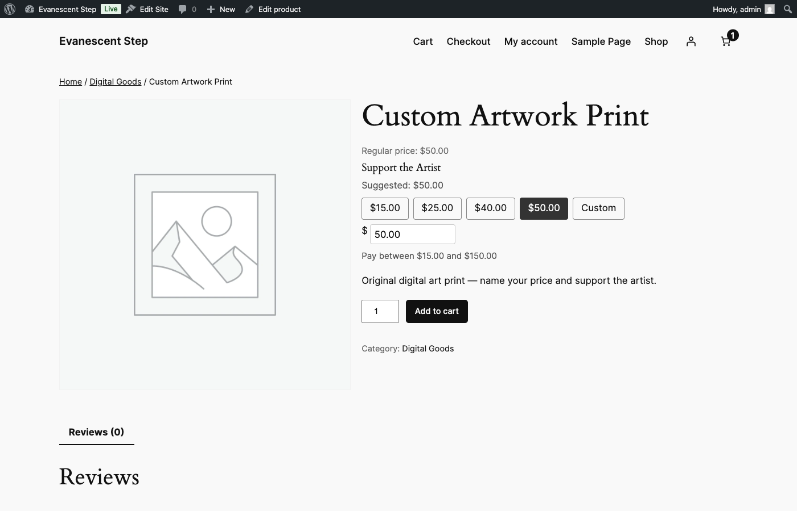
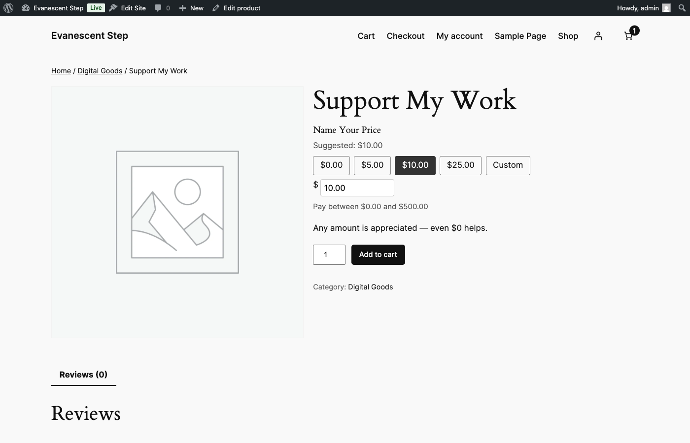
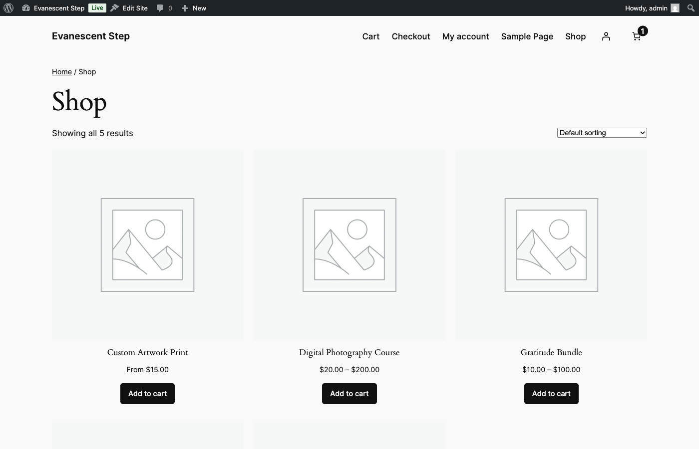

# Customer Experience

This guide covers what your customers see and interact with on the frontend when they encounter a PWYW-enabled product. Everything described here is controlled by the settings you configure in the [Global Settings](02-global-settings.md) tab and per-product overrides in the [Product Setup](03-product-setup.md) panel.

---

## Product Page PWYW Interface

When a customer visits a product with PWYW enabled, the standard WooCommerce price and "Add to cart" button are replaced with a PWYW pricing interface. Depending on the display style you have selected, the customer may see some or all of the following elements:

- **Price input field** -- A text input with a currency symbol label where the customer types their chosen price. It is pre-filled with the suggested price by default.
- **Suggested price label** -- A line of text showing the suggested price for reference (e.g., "Suggested: $50.00").
- **Preset quick-select buttons** -- Clickable buttons for common price points (e.g., $15, $25, $40, $50, Custom). Clicking a button sets the input to that amount instantly.
- **Boundary label** -- A line showing the allowed price range (e.g., "Pay between $15.00 and $150.00").
- **Regular price reference** -- The product's regular price may be shown for context, either crossed out or displayed as "Regular price: $50.00".

The exact combination of these elements depends on the display style. See the next section for details.

---

## Display Styles

There are four display styles available. You can set a default style globally in **WooCommerce > Settings > Pay What You Want**, and optionally override it on individual products or variations.

### Style A -- Input + Labels

Shows the price input field with minimum, suggested, and maximum price labels displayed prominently. No preset buttons appear.

**Best for:** Products where you want customers to see all pricing guidance clearly without the distraction of preset options. Works well when you want customers to type their own amount within a well-communicated range.

**What the customer sees:**
- Price input field (pre-filled with suggested price)
- Suggested price label
- Boundary label showing the minimum and maximum

### Style B -- Input + Preset Buttons

Shows the price input field alongside preset quick-select buttons. No explicit minimum/maximum labels are shown -- the presets themselves imply the expected price range.

**Best for:** Products where you want to guide customers toward specific price points. This is the most popular style because the preset buttons make it easy for customers to pick a price with a single click.

**What the customer sees:**
- Price input field (pre-filled with suggested price)
- Preset quick-select buttons
- A "Custom" button for manual entry

### Style C -- Input + Presets + Labels

The most comprehensive style. Shows everything: the price input field, preset buttons, and minimum/suggested/maximum labels. This gives customers the most information at a glance.

**Best for:** Products where you want maximum transparency. Customers see the full allowed range, the suggested price, and convenient preset options all at once.

**What the customer sees:**
- Price input field (pre-filled with suggested price)
- Preset quick-select buttons
- Suggested price label
- Boundary label showing the minimum and maximum

### Style D -- Minimal (Input Only)

Just the price input field with no additional elements. No preset buttons, no labels, no boundary indicators.

**Best for:** Donation-style products, tips, or any situation where you want a clean, minimal interface. Also useful when the product description itself explains the pricing model and you do not need on-screen guidance.

**What the customer sees:**
- Price input field (pre-filled with suggested price)
- Nothing else

---

## Preset Quick-Select Buttons

Preset buttons give customers a fast way to select a price without typing. They appear in styles B and C.

**How they work:**

- Each button shows a formatted price (e.g., "$15.00", "$25.00", "$40.00", "$50.00").
- Clicking a button immediately sets the price input to that amount.
- A **"Custom" button** is always included at the end. Clicking it focuses the price input field so the customer can type any amount manually.
- The currently selected preset is highlighted with a darker, filled button style so customers can see which option is active.
- If any preset amounts fall outside the product's minimum or maximum price range, those buttons are automatically hidden. Customers never see an option they cannot actually select.

Preset amounts are configured globally in the settings tab and can be overridden per product or per variation. See [Global Settings](02-global-settings.md) and [Product Setup](03-product-setup.md) for configuration details.

---

## Real-Time Validation

As the customer types in the price input field, the plugin validates their entry in real time. Validation fires with a short delay (300 milliseconds) after the customer stops typing, so it does not interrupt them mid-keystroke.

**Validation rules and messages:**

| Condition | Message shown |
|---|---|
| Price is below the minimum | "Please enter at least $15.00" |
| Price is above the maximum | "Please enter no more than $150.00" |
| Input is not a valid number | "Please enter a valid price" |

When a validation error is present:

- The error message appears directly below the price input field.
- The **"Add to cart" button is disabled** so the customer cannot submit an invalid price.
- The error clears automatically as soon as the customer corrects the price to a valid amount.

This prevents invalid prices from ever reaching the cart or checkout.

---

## Returning Customers

For logged-in customers who have previously purchased a PWYW product, the plugin remembers their last-paid price and uses it to personalize the experience.

**What returning customers see:**

- The price input field is **pre-filled with their last-paid price** instead of the suggested price -- but only if that price still falls within the product's current minimum and maximum boundaries.
- A note appears below the input: "[Customer name] paid $X for this item before."
- If the customer's last-paid price is now outside the current boundaries (for example, if you raised the minimum since their last purchase), the plugin falls back to the suggested price instead.

This feature only applies to logged-in customers. Guests always see the suggested price.

---

## Shop and Archive Page Display

On the shop page, category pages, search results, and other archive/listing pages, PWYW products display their price differently from the standard product page. You control this with the **Archive Display Style** setting in **WooCommerce > Settings > Pay What You Want**.

The available archive display options are:

| Archive Display Style | What the customer sees | Example |
|---|---|---|
| Show price range | The full range from minimum to maximum | "$15.00 -- $150.00" |
| Show suggested price only | The suggested price as if it were the regular price | "$50.00" |
| Show "From $X" | The minimum price with a "From" prefix | "From $15.00" |
| Show "Name Your Price" | A text badge instead of a numeric price | "Name Your Price" |

Choose the style that best fits your store's look and messaging. "Show price range" gives the most information upfront. "Show suggested price only" keeps things simple. "From $X" emphasizes the low entry point. "Name Your Price" draws attention and curiosity.

---

## Quick-Add to Cart from Shop Pages

When a customer clicks the "Add to cart" button directly from a shop or archive page (without visiting the product page first), the plugin needs to determine what price to use since the customer has not entered one manually.

You control this behavior with the **Quick-Add Behavior** setting. The three options are:

| Quick-Add Behavior | What happens |
|---|---|
| Pre-fill with suggested price | The product is added to the cart at the suggested price. |
| Pre-fill with minimum price | The product is added to the cart at the minimum price. |
| Block quick-add | The "Add to cart" button is replaced with a link that directs the customer to the product page, where they can set their own price. |

Regardless of which option you choose, customers can always adjust their PWYW price later from the cart page before checkout. See [Cart & Checkout](06-cart-checkout.md) for details on cart price editing.

---

Next: [Cart & Checkout](06-cart-checkout.md) -- How PWYW prices work in the cart, with coupons, and through checkout.
