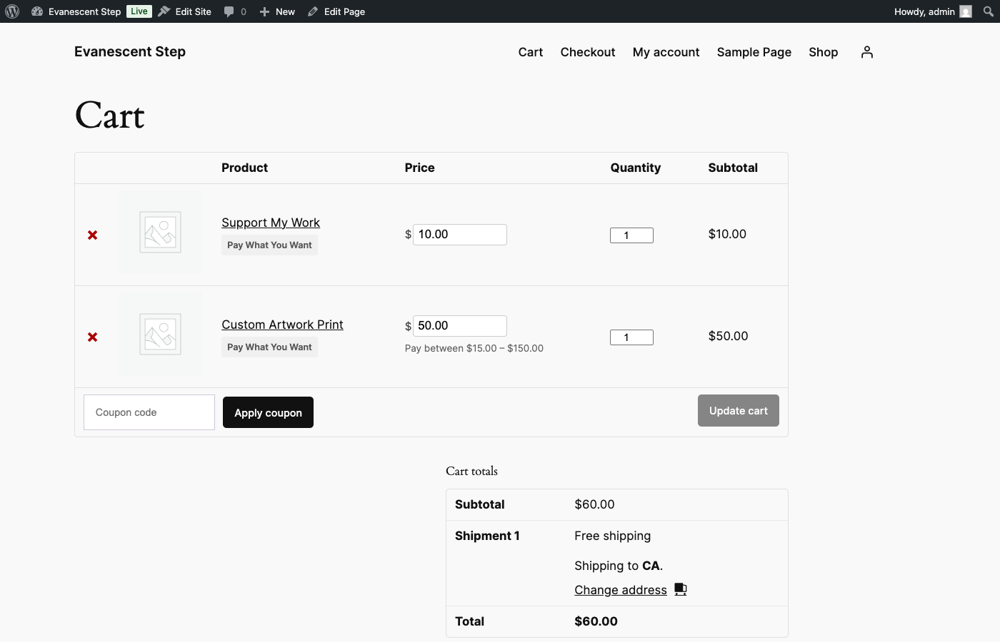
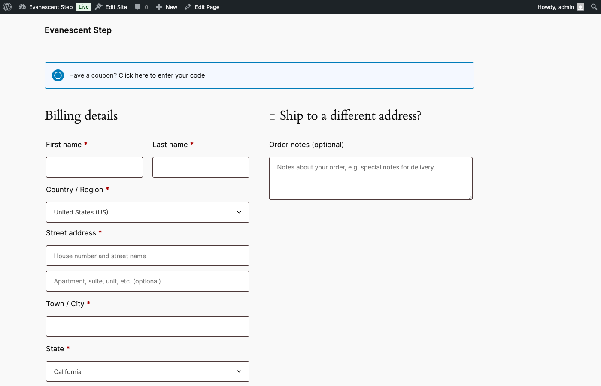

# Cart & Checkout

This guide explains what happens when a Pay What You Want item is added to the cart, how customers can edit their price before checking out, how coupons interact with PWYW pricing, and what data is captured when an order is placed.

## Cart Display

When a PWYW product is in the cart, the cart page looks slightly different from a standard WooCommerce cart.

Here is what changes for each PWYW line item:

| Column | What the Customer Sees |
|--------|------------------------|
| **Product** | The product name with a **"Pay What You Want"** badge displayed below it |
| **Price** | An editable number input field with a currency symbol (e.g., `$ 50.00`) instead of a static price |
| **Quantity** | The standard WooCommerce quantity selector -- works as usual |
| **Subtotal** | The calculated total: customer-set price multiplied by quantity |

Below the price input, a **boundary label** is displayed when the product has both a minimum and maximum price configured. For example:

> Pay between $15.00 -- $150.00

If only a minimum price is set (no maximum), the label reads:

> Minimum: $15.00

This label reminds customers of the allowed price range without them needing to go back to the product page.

## In-Cart Price Editing

Customers can change their PWYW price directly from the cart page without returning to the product page. This is one of the key convenience features of the plugin.

### How it works

1. The customer clicks on the price input field in the **Price** column.
2. They type a new price (or use the browser's up/down arrows to adjust the value).
3. When the customer clicks away from the field (blur) or presses **Enter**, the new price is submitted.
4. The update happens via AJAX -- the page does not reload.
5. If the new price is valid, the **Subtotal** column and the **Cart totals** section update automatically to reflect the change.
6. Tax is recalculated based on the new price.

### Validation

Price validation happens in real time as the customer submits a new value. If the price is invalid, an inline error message appears directly below the input field:

- **Below minimum:** A message like "Min. price is $15.00" appears.
- **Above maximum:** A message like "Max. price is $150.00" appears.
- **Invalid input:** A message like "Please enter a valid price" appears for non-numeric or otherwise unparseable values.

The error message disappears once the customer corrects the price and submits a valid amount. The cart totals do not change until a valid price is accepted.

## Mixed Cart Restriction

This is an optional feature that prevents customers from mixing PWYW products and regular fixed-price products in the same cart. It is controlled by the **"Prevent PWYW and fixed-price items in the same cart"** setting on the global settings page (**WooCommerce > Settings > Pay What You Want**).

### When enabled

If a customer tries to add a PWYW product while regular-priced items are already in the cart, the product is not added and a notice appears:

> "Your cart contains regular-priced items. Please complete your current purchase before adding Pay What You Want products."

The reverse is also enforced. If PWYW items are in the cart and the customer tries to add a regular-priced product:

> "Your cart contains a Pay What You Want item. Please complete your current purchase before adding regular-priced products."

### When disabled

Customers can freely mix PWYW products and regular-priced products in the same cart. This is the default behavior if you have not turned on the restriction.

### When to use this

Enable mixed cart restriction if your store needs clear separation between PWYW and standard orders -- for example, if your fulfillment or accounting workflows treat them differently. Disable it if you want customers to shop freely without limitations.

## Coupon Interaction

The plugin provides three coupon behavior modes that control how discount coupons interact with PWYW pricing. You can set a global default in the settings tab and override it on individual products.

### Allow coupons (no floor)

Coupons apply to the customer-set price using standard WooCommerce discount math. There is no special handling.

- A 50% coupon on a $25 customer-set price results in $12.50 -- even if the product's minimum price is $15.
- The final price **can go below the minimum** after the coupon is applied.

**Best for:** Maximum flexibility. Use this when you trust that your coupon values are reasonable and you do not need to protect the minimum price boundary after discounts.

### Allow coupons but floor at minimum price

Coupons apply, but the plugin caps the discount so the final price never drops below the product's minimum price.

**Example:** A customer sets their price at $25. The product's minimum price is $15. The customer applies a 50% coupon.

- Standard math: $25 x 50% = $12.50 discount, final price $12.50
- With floor: The discount is capped so the final price stops at $15.00 instead of $12.50

When the floor is hit, the customer sees a notice explaining that the discount was limited:

> "The coupon discount on 'Custom Artwork Print' has been limited to maintain the minimum price of $15.00."

**Best for:** Most stores. This gives customers the benefit of coupons while ensuring you never sell below your floor price. This is the recommended setting for most use cases.

### Block all coupons on PWYW items

Coupon discounts are completely zeroed out for PWYW line items. The customer-set price remains unchanged regardless of any coupon applied.

- Non-PWYW items in the same order still receive coupon discounts normally.
- When a coupon is applied, the customer sees a notice: "Coupon 'SAVE20' does not apply to Pay What You Want items. The discount has been applied to the remaining eligible items in your cart."

**Best for:** When you consider the customer's chosen price as the final, non-negotiable amount. Common for donation-style products or when you want to keep PWYW pricing entirely separate from your promotional campaigns.

### Where to configure coupon behavior

- **Globally:** Go to **WooCommerce > Settings > Pay What You Want** and find the coupon mode setting.
- **Per product:** Edit the product, open the **Pay What You Want** tab, and change the **Coupon Behaviour** dropdown. Select "Use global default" to inherit the global setting, or choose a specific mode for that product.

Per-product settings take priority over the global setting.

## Checkout Display

When the customer proceeds to checkout, PWYW items behave differently from the cart page.

Key differences at checkout:

- The PWYW price is displayed as **read-only text** -- customers cannot edit the price at this stage. If they want to change their price, they need to go back to the cart.
- The "Pay What You Want" badge still appears next to the product name, along with the customer's chosen price (e.g., "Pay What You Want -- Your chosen price: $50.00").
- All standard checkout fields (billing, shipping, payment method) work normally.
- Tax, shipping, and order totals are calculated based on the customer-set PWYW price, just like any other WooCommerce product.
- The PWYW price is locked in when the customer clicks **Place order**.

## What Happens After Checkout

When an order containing PWYW items is placed, the plugin captures a snapshot of the pricing data at the time of purchase. This data is stored permanently in the order and cannot be changed by later edits to the product's PWYW settings.

### Data saved per PWYW line item

| Data | Description |
|------|-------------|
| **Customer price** | The price the customer chose to pay |
| **Suggested price** | The suggested price that was configured at the time of purchase |
| **Minimum price** | The minimum price boundary at the time of purchase |
| **Maximum price** | The maximum price boundary at the time of purchase |

### Why this matters

- If you change a product's minimum price from $15 to $20 next month, orders placed before the change still show the original $15 minimum. You always have an accurate historical record.
- The suggested price is stored so you can compare what you suggested versus what the customer actually paid. This is useful for understanding pricing behavior over time.
- All of this data is visible to admins in the order detail view (see [Orders & Analytics](07-orders-analytics.md)).

### Additional post-checkout behavior

- **Analytics:** PWYW order data is written to the analytics table for use in the dashboard widget and reports.
- **Last-paid price:** For logged-in customers, the plugin remembers the last price they paid for each PWYW product. This can be used to pre-fill the price input on future visits.
- **Email notifications:** Depending on your threshold settings, email alerts may trigger based on the customer's chosen price. See [Orders & Analytics](07-orders-analytics.md) for details.

---

Next: [Orders & Analytics](07-orders-analytics.md) -- Viewing PWYW data in orders, the dashboard widget, email alerts, and CSV export.
