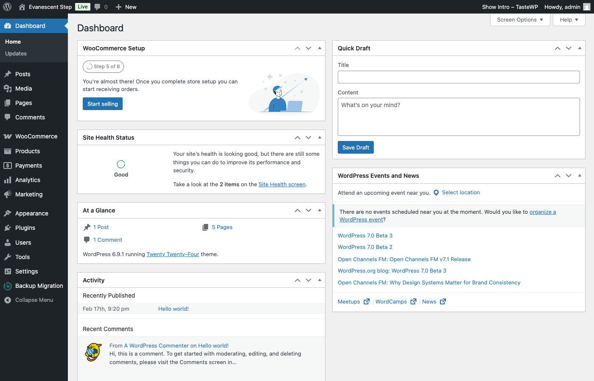

# Orders & Analytics

Every time a customer completes a PWYW purchase, the plugin captures detailed pricing data and makes it available throughout the WooCommerce admin. This guide covers what data is stored, where to find it, and the reporting tools available to you.

---

## Table of Contents

- [Order Data](#order-data)
- [Admin Order Detail View](#admin-order-detail-view)
- [Dashboard Widget](#dashboard-widget)
- [Email Notifications](#email-notifications)
- [CSV Order Export](#csv-order-export)

---

## Order Data

When a PWYW order is completed, the following data is captured and stored permanently on each PWYW line item:

| Data Point | Description |
|------------|-------------|
| **Customer Price** | The price the customer chose to pay |
| **Suggested Price** | The suggested price that was active at the time of purchase |
| **Minimum Price** | The minimum allowed price at the time of purchase |
| **Maximum Price** | The maximum allowed price at the time of purchase |

This data is a **snapshot** taken at the moment of purchase. Even if you change a product's PWYW settings later -- adjusting the suggested price, widening the min/max range, or disabling PWYW entirely -- the order data continues to reflect the settings that were active when the customer bought. This means your historical order data is always accurate and never retroactively affected by configuration changes.

---

## Admin Order Detail View

When viewing an individual order in **WooCommerce > Orders > [order]**, each PWYW line item displays a read-only information panel directly below it.

### What the Panel Shows

- **Customer Price** -- The price the customer entered and paid.
- **Suggested Price** -- The suggested price at the time of purchase.
- **Variance** -- The difference between the customer price and the suggested price, displayed as both a dollar amount and a percentage.

### Understanding the Variance

The variance tells you at a glance whether the customer paid more or less than your suggested price:

| Variance | Color | Meaning |
|----------|-------|---------|
| Positive (e.g., +$5.00 / +10%) | Green | Customer paid **more** than the suggested price |
| Negative (e.g., -$10.00 / -20%) | Red | Customer paid **less** than the suggested price |
| Zero ($0.00 / 0%) | Neutral | Customer paid **exactly** the suggested price |

This panel is read-only -- it reflects the data captured at purchase time and cannot be edited.

---

## Dashboard Widget

A **"Pay What You Want -- Overview"** widget appears on the main WordPress Dashboard (**WP Admin > Dashboard**), giving you a quick summary of PWYW performance without leaving the dashboard.

### Time Range Selector

At the top of the widget, a dropdown lets you select the period to analyze:

- **Last 7 days**
- **Last 30 days**
- **Last 90 days**
- **All time**

Your selection is saved per-user and remembered between sessions, so the widget shows your preferred time range every time you visit the dashboard.

### Metrics Displayed

The widget displays six key metrics for the selected time period:

#### 1. Total PWYW Revenue

The sum of all PWYW line item revenue in the selected period. This counts only PWYW items -- non-PWYW products in the same orders are excluded.

#### 2. Total PWYW Orders

The number of orders that contain at least one PWYW product. An order with multiple PWYW items is counted once.

#### 3. Average PWYW Price

The mean customer-set price across all individual PWYW line items in the selected period.

#### 4. Average vs. Suggested

A percentage showing how customer prices compare to suggested prices on average. For example:

- **-5%** means customers pay 5% below suggested on average
- **+12%** means customers pay 12% above suggested on average
- **0%** means customers pay exactly the suggested price on average

This is one of the most useful metrics for understanding whether your suggested prices are calibrated well.

#### 5. Price Distribution Breakdown

A visual breakdown showing how many orders fell into each pricing category:

| Category | Description |
|----------|-------------|
| At minimum | Customer paid exactly the minimum allowed price |
| Below suggested | Customer paid more than the minimum but less than the suggested price |
| At suggested | Customer paid exactly the suggested price |
| Above suggested | Customer paid more than the suggested price but less than the maximum |
| At maximum | Customer paid exactly the maximum allowed price |

This distribution helps you understand customer pricing behavior at a glance. For example, if most orders cluster at the minimum, you may want to lower the minimum or adjust the suggested price. If many orders are at or above the suggested price, your pricing strategy is working well.

#### 6. Top 5 PWYW Products by Revenue

A ranked list of your five best-performing PWYW products by total revenue in the selected period. Use this to identify which products generate the most PWYW income and which ones might need pricing adjustments.

---

## Email Notifications

The plugin can send email alerts when customers pay significantly above or below the suggested price. These notifications help you stay informed about unusual pricing activity without checking the dashboard constantly.

### Below-Threshold Alert

This alert fires when a customer pays more than a specified percentage below the suggested price.

- **Default threshold:** 30%
- **Example:** The suggested price is $50.00 and your threshold is set to 30%. A customer who pays $30.00 (40% below suggested) triggers the alert. A customer who pays $40.00 (20% below) does not.
- **Email includes:** Product name, customer price, suggested price, difference (amount and percentage), and a direct link to the order.

This alert is useful for monitoring whether customers frequently undervalue your products, which could indicate that your minimum price is too low or that the product page does not effectively communicate the product's value.

### Above-Threshold Alert

This alert fires when a customer pays more than a specified percentage above the suggested price.

- **Default threshold:** 50%
- **Example:** The suggested price is $50.00 and your threshold is set to 50%. A customer who pays $80.00 (60% above suggested) triggers the alert. A customer who pays $70.00 (40% above) does not.
- **Email includes:** Product name, customer price, suggested price, difference (amount and percentage), and a direct link to the order.

This alert is useful for tracking customer generosity and identifying products where customers perceive particularly high value. Consider raising the suggested price on products that consistently trigger above-threshold alerts.

### Configuring Email Alerts

Both alert types are configured in **WooCommerce > Settings > Pay What You Want** under the **Email Notifications** section.

| Setting | Description |
|---------|-------------|
| **Enable below-threshold alert** | Turn this alert type on or off independently |
| **Below-threshold percentage** | The percentage below suggested that triggers the alert (default: 30%) |
| **Enable above-threshold alert** | Turn this alert type on or off independently |
| **Above-threshold percentage** | The percentage above suggested that triggers the alert (default: 50%) |
| **Recipient email(s)** | One or more email addresses to receive alerts, separated by commas |

**When alerts fire:** Alerts are sent when an order status changes to "processing" or "completed." This means the alert fires after payment has been confirmed, not when the order is first placed.

---

## CSV Order Export

The plugin adds extra columns to WooCommerce's built-in CSV order export, so you can analyze PWYW data in a spreadsheet or import it into external reporting tools.

### Added Columns

| Column | Description |
|--------|-------------|
| **PWYW Enabled** | "Yes" if all line items are PWYW, "No" if none are, or "Mixed" if the order contains both PWYW and non-PWYW products |
| **PWYW Customer Price** | Total of all customer-set prices for PWYW items in the order |
| **PWYW Suggested Price** | Total of all suggested prices at purchase time for PWYW items |
| **PWYW Difference** | Amount difference between customer price total and suggested price total (customer minus suggested) |
| **PWYW Difference %** | Percentage difference between customer price total and suggested price total |

### How to Export

1. Go to **WooCommerce > Orders**.
2. Click the **Export** button.
3. Configure any date range or status filters as needed.
4. Run the export -- the PWYW columns are included automatically alongside all standard WooCommerce order columns.

No additional configuration is required. The PWYW columns appear for every export as long as the plugin is active.

---

Previous: [Cart & Checkout](06-cart-checkout.md) -- Cart price editing, coupons, mixed cart rules, and checkout.

Next: [Bulk Management](08-bulk-management.md) -- Bulk enable/disable PWYW and the product list column.
