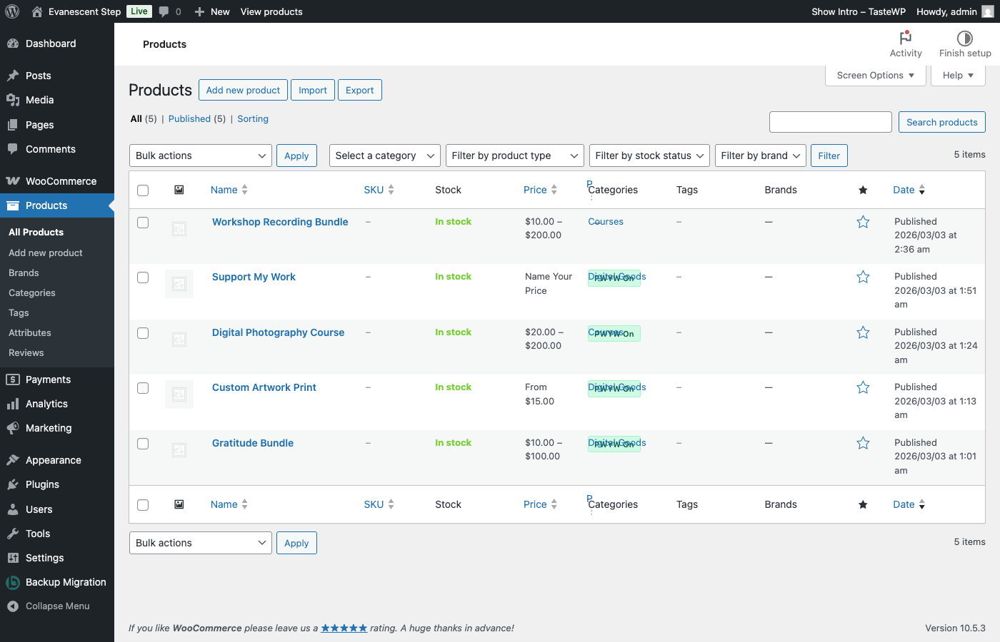

# Bulk Management

This guide covers the tools available for managing PWYW across many products at once from the WooCommerce products list (**WooCommerce > Products**).

---

## PWYW Column in the Products List

The plugin adds a **PWYW** column to the products list table. This column shows the PWYW status of each product at a glance:

- **PWYW On** (green badge) -- PWYW is enabled for this product.
- **PWYW Off** (gray badge) -- PWYW is not enabled for this product.
- **--** (em-dash) -- Shown for variable products, since PWYW is configured per-variation rather than at the product level. See [Variable Products](04-variable-products.md) for details.

The column is **sortable**. Click the column header to sort all products by their PWYW status, making it easy to see which products have PWYW enabled and which do not.

---

## Bulk Actions

Two bulk actions are added to the standard "Bulk actions" dropdown at the top of the products list.

### Enable Pay What You Want

1. Select products by checking the boxes on the left side of the products list.
2. Open the **Bulk actions** dropdown at the top of the list.
3. Choose **Enable Pay What You Want**.
4. Click **Apply**.
5. A success notice appears: "Pay What You Want has been enabled for X product(s)."

All selected products will have PWYW enabled using your global default settings (percentage-based minimum, maximum, and suggested prices). Products that are already PWYW-enabled are skipped and not double-counted.

### Disable Pay What You Want

1. Select products by checking the boxes on the left side of the products list.
2. Open the **Bulk actions** dropdown at the top of the list.
3. Choose **Disable Pay What You Want**.
4. Click **Apply**.
5. A success notice appears: "Pay What You Want has been disabled for X product(s)."

All selected products will have PWYW disabled. Products that are already PWYW-disabled are skipped and not double-counted.

---

## Tips for Bulk Management

- **Quick rollout** -- Use bulk enable to turn on PWYW for many products at once. They will all use your global default settings (percentages of each product's regular price). You can fine-tune individual products later from their [Product Setup](03-product-setup.md) tabs.
- **Seasonal adjustments** -- Bulk disable PWYW before a sale period when you want to use fixed pricing, then bulk enable it again after the sale ends.
- **Filter first** -- Use the category or product type filters at the top of the products list before selecting and applying bulk actions. This lets you target a specific subset of products rather than scrolling through your entire catalog.
- **Variable products** -- Bulk enable/disable applies to the parent product level. Any per-variation overrides you have configured are unaffected by bulk actions. See [Variable Products](04-variable-products.md) for how variation-level settings work.

---

Previous: [Analytics & Reporting](07-analytics.md)
